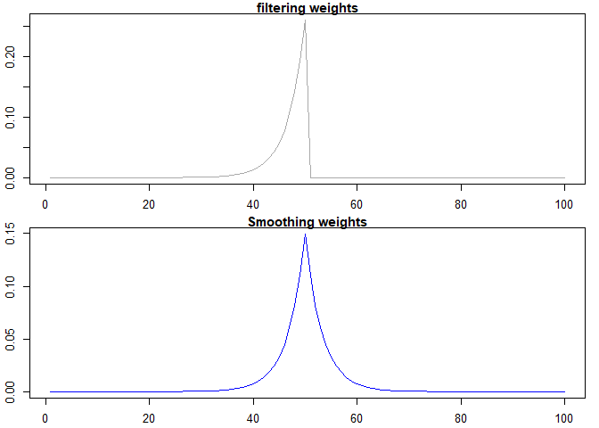
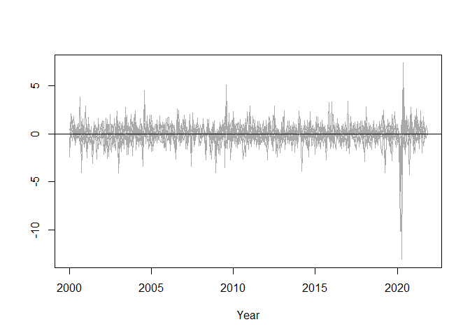

<!-- README.md is generated from README.Rmd. Please edit that file -->

# wex

<!-- badges: start -->
<!-- badges: end -->

`wex` is an R package designed to compute the exact observation weights
for the Kalman filter and smoother using the method described in Koopman
and Harvey (2003). It offers an in-depth exploration of state-space
models, enabling researchers and practitioners to extract valuable
insights from their time series data. This functionality is particularly
useful in dynamic factor models, where the weights can be employed to
decompose the contributions of individual variables to the latent
factors (see Example 2 below).

## Installation

You can install the development version of wex from
[GitHub](https://github.com/) with:

``` r
# install.packages("devtools")
devtools::install_github("timginker/wex")
```

## Example 1: Local level model

In this illustrative example, we fit the local level model to the Nile
dataset and compute the associated smoothed and filtered values.

The resulting estimates are presented in the plot below:

 Now,
w.l.o.g., let’s consider the 50th value of the estimated local level

    #> smoothed level[50] =  834.9828

Koopman and Harvey (2003) showed that the smoothed estimates can be
represented as:

$$
\alpha _{t|T}=\sum_{j=1}^{T}w_{j}(\alpha _{t|T})y_{j}.
$$ Similarly, the filtered estimated can be computed as:

$$
\alpha _{t|t}=\sum_{j=1}^{t}w_{j}(\alpha _{t|Tt})y_{j}.
$$

Now, We can compute the weight of each observation using the `wex`
function, and compare the local level estimates obtained from the
weighted average of the observed data with the associated estimates
obtained from the Kalman filter and smoother.

``` r
wts=wex(Tt=matrix(1),
        Zt=matrix(1),
        HHt = matrix(1385.066),
        GGt = matrix(15124.13),
        yt = t(y),
        t=50)
```

We can also visualize the weights assigned to each observation:

``` r
par(mfrow = c(2, 1),
    mar = c(2.2, 2.2, 1, 1),
    cex = 0.8)
plot(
  wts$Wt,
  col = "darkgrey",
  xlab = "",
  ylab = "",
  lwd = 1.5,
  type="l",
  main="Filtering weights"
)
plot(
  wts$WtT,
  col = "blue",
  xlab = "",
  ylab = " ",
  lwd = 1.5,
  type="l",
  main="Smoothing weights"
)
```



It is also easy to verify the identity between the smoothed and filtered
levels obtained from the Kalman filter and the corresponding estimates
computed using the weights.

``` r
cat("\n Smoothed level computed using the weights = ",
    sum(y*as.numeric(wts$WtT),na.rm = T),
    " \n Smoothed level from the Kalman Filter = ",fit_ks$ahatt[50])
#> 
#>  Smoothed level computed using the weights =  834.9828  
#>  Smoothed level from the Kalman Filter =  834.9828
```

``` r
cat("\n Filtered level computed using the weights = ",
    sum(y*as.numeric(wts$Wt),na.rm = T),
    " \n Filtered level from the Kalman Filter = ",fit_kf$att[50])
#> 
#>  Filtered level computed using the weights =  849.307  
#>  Filtered level from the Kalman Filter =  849.307
```

## Example 2:

In this example we show how to compute observation weights for a Dynamic
Factor Model (DFM) which are then used to decompose the latent factor
into the contribution of each variable.

More formally, let $x_{t}=(x_{1,t},x_{2,t},...,x_{n,t})^{\prime}$ with
$t =1,2,...,T$ be a vector of $n$ monthly series that have been
transformed to become stationary and standardized. A dynamic factor
model (DFM) assumes that it is possible to decompose $x_{t}$ into two
unobserved orthogonal components representing common and idiosyncratic
factors. The model is specified as follows:

$$
x_{t}=\Lambda F_{t}+\varepsilon_{t}, \hspace{2pt} \varepsilon_{t}\sim N(0,R),
$$ where $F_{t}$ is an $(r \times 1)$ vector of unobserved common
factors, $\Lambda$ is an $(n \times r)$ matrix of their loadings, and
$\varepsilon_{t}$ is an $(n \times 1)$ vector of the idiosyncratic
components. The factors are assumed to have the following stationary
VAR(p) representation:

$$
F_{t}=\sum_{s=1}^{p}\Phi _{s}F_{t-s}+u_{t},\hspace{2pt} u_{t}\sim N(0,Q)
$$ where $\Phi_{s}$ are $(r \times r)$ matrices of autoregressive
coefficients. The related inference and forecast procedures can be
carried out using the standard Kalman filter techniques.

Here’s a slightly revised version for improved grammar and coherence:

In this illustrative example, we use a dataset containing 10 monthly
economic indicators covering the period from January 2000 to November
2021. All variables have been log-differenced, when necessary, to
achieve stationarity. We assume that there is a single laten factor that
follows an AR(1) process.

The normalized data series are summarized in the plot below:



Below, we use the `wex` function to decompose the last value of the
latent factor into a contribution of each variable.

``` r
# defining the stat-space matrices
Zt <- matrix(c(0.37873307, 0.37438154, 0.37767322,
                 0.02433999, 0.36020426, 0.23031769,
                 0.36584474, 0.35066644, 0.33420247,
                 0.01379571),
          ncol=1
)

Tt <- matrix(-0.3676422)

HHt <- matrix(1)

GGt <- matrix(c(
  0.7891011, 0, 0, 0, 0, 0, 0, 0, 0, 0,
  0, 0.3235747, 0, 0, 0, 0, 0, 0, 0, 0,
  0, 0, 0.7673983, 0, 0, 0, 0, 0, 0, 0,
  0, 0, 0, 0.01704776, 0, 0, 0, 0, 0, 0,
  0, 0, 0, 0, 0.9979156, 0, 0, 0, 0, 0,
  0, 0, 0, 0, 0, 0.8496217, 0, 0, 0, 0,
  0, 0, 0, 0, 0, 0, 0.8132641, 0, 0, 0,
  0, 0, 0, 0, 0, 0, 0, 0.9084006, 0, 0,
  0, 0, 0, 0, 0, 0, 0, 0, 0.7601053, 0,
  0, 0, 0, 0, 0, 0, 0, 0, 0, 0.1789897
), nrow = 10, ncol = 10, byrow = TRUE)

# Extracting weights for the last obseravtion
wts <- wex(Tt=Tt,
        Zt=Zt,
        HHt = HHt,
        GGt = GGt,
        yt = t(df),
        t=nrow(df))
# Computing contributions

ctr <- matrix(0,nrow=nrow(df),ncol=ncol(df))

for (i in 1:nrow(df)) {
  
  ctr[i,]=as.numeric(wts$WtT[,,i]*df[i,])
  
}

ctr <- data.frame(ctr)
colnames(ctr) <-colnames(df)

contributions <- colSums(ctr,na.rm=T)
```

The contributons are summarized in the Table below:

<table class=" lightable-classic" style="font-family: Cambria; width: auto !important; margin-left: auto; margin-right: auto;">
<caption>
Varibale Contributions
</caption>
<thead>
<tr>
<th style="text-align:left;">
Variable
</th>
<th style="text-align:right;">
Contribution
</th>
</tr>
</thead>
<tbody>
<tr>
<td style="text-align:left;">
Total industrial production in Israel
</td>
<td style="text-align:right;">
0.044
</td>
</tr>
<tr>
<td style="text-align:left;">
Trade revenue
</td>
<td style="text-align:right;">
0.065
</td>
</tr>
<tr>
<td style="text-align:left;">
Service revenue
</td>
<td style="text-align:right;">
-0.023
</td>
</tr>
<tr>
<td style="text-align:left;">
Employment (excluding absent workers)
</td>
<td style="text-align:right;">
0.060
</td>
</tr>
<tr>
<td style="text-align:left;">
Exports of services
</td>
<td style="text-align:right;">
0.010
</td>
</tr>
<tr>
<td style="text-align:left;">
Building starts
</td>
<td style="text-align:right;">
0.001
</td>
</tr>
<tr>
<td style="text-align:left;">
Imports of consumer goods
</td>
<td style="text-align:right;">
0.019
</td>
</tr>
<tr>
<td style="text-align:left;">
Imports of production inputs
</td>
<td style="text-align:right;">
0.010
</td>
</tr>
<tr>
<td style="text-align:left;">
Exports of goods
</td>
<td style="text-align:right;">
0.003
</td>
</tr>
<tr>
<td style="text-align:left;">
Job openings
</td>
<td style="text-align:right;">
-0.002
</td>
</tr>
<tr>
<td style="text-align:left;">
Total
</td>
<td style="text-align:right;">
0.188
</td>
</tr>
</tbody>
</table>

# References

Koopman, S. J., & Harvey, A. (2003). Computing observation weights for
signal extraction and filtering. Journal of Economic Dynamics and
Control, 27(7), 1317-1333.

# Disclaimer

The views expressed here are solely of the author and do not necessarily
represent the views of the Bank of Israel.

Please note that `wex` is still under development and may contain bugs
or other issues that have not yet been resolved. While we have made
every effort to ensure that the package is functional and reliable, we
cannot guarantee its performance in all situations.

We strongly advise that you regularly check for updates and install any
new versions that become available, as these may contain important bug
fixes and other improvements. By using this package, you acknowledge and
accept that it is provided on an “as is” basis, and that we make no
warranties or representations regarding its suitability for your
specific needs or purposes.
