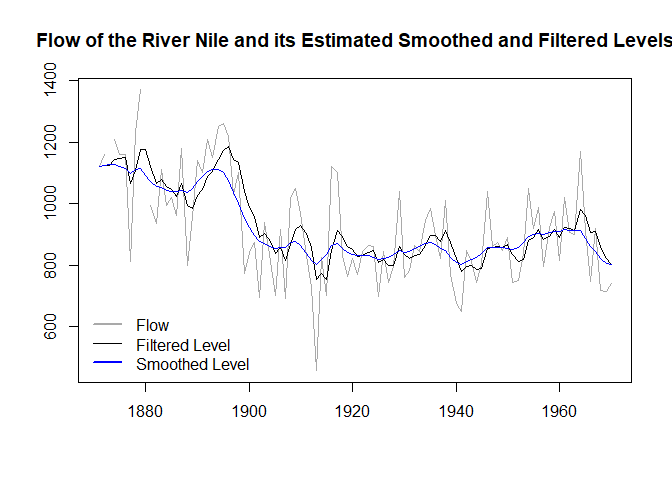

<!-- README.md is generated from README.Rmd. Please edit that file -->

# wex

<!-- badges: start -->
<!-- badges: end -->

`wex` is an R package designed to compute the exact observation weights
for the Kalman filter and smoother using the method described in Koopman
and Harvey (2003). Built on top of the FKF package, `wex` enhances the
functionality of the existing packages and allows to get further
insights from the state space models, as is illustrated in a number of
motivating examples below.

## Installation

You can install the development version of wex from
[GitHub](https://github.com/) with:

``` r
# install.packages("devtools")
devtools::install_github("timginker/wex")
```

## Example 1: Local level model

In this example, we fit the local level model to the Nile dataset and
compute the associated smoothed and filtered values.

The resulting estimates are presented in the plot below:

 Now,
w.l.o.g., let’s consider the 50th value of the estimated local level

``` r
cat("smoothed level[50] = ",mu_T[50])
#> smoothed level[50] =  834.9828
```

It is computed as (insert formula here).

Now, We can compute the weight of each observation using the `wex`
function, and compare the local level estimates obtained from the
weighted average of the observed data with the associated estimates
obtained from the Kalman filter and smoother.

``` r
wts=wex(Tt=matrix(1),
        Zt=matrix(1),
        HHt = matrix(1385.066),
        GGt = matrix(15124.13),
        yt = t(y),
        t=50)
```

We can also visualize the weights assigned to each observation:

``` r
par(mfrow = c(2, 1),
    mar = c(2.2, 2.2, 1, 1),
    cex = 0.8)
plot(
  wts$Wt,
  col = "darkgrey",
  xlab = "",
  ylab = "",
  lwd = 1.5,
  type="l",
  main="Filtering weights"
)
plot(
  wts$WtT,
  col = "blue",
  xlab = "",
  ylab = " ",
  lwd = 1.5,
  type="l",
  main="Smoothing weights"
)
```


It is also easy to verify the identity between the smoothed and filtered
levels obtained from the Kalman filter and the corresponding estimates
computed using the weights.

    #> 
    #>  Smoothed level computed using the weights =  834.9828  
    #>  Smoothed level from the Kalman Filter =  834.9828

    #> 
    #>  Filtered level computed using the weights =  849.307  
    #>  Filtered level from the Kalman Filter =  849.307

## Example 2:
